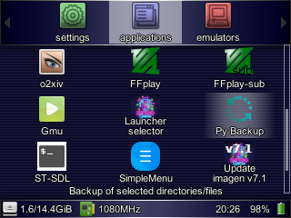
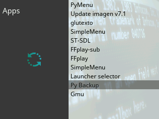
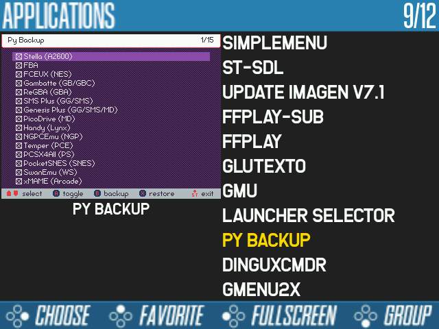
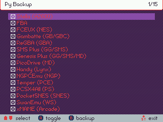
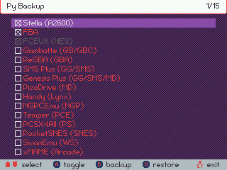
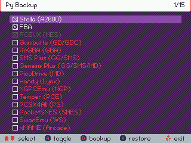
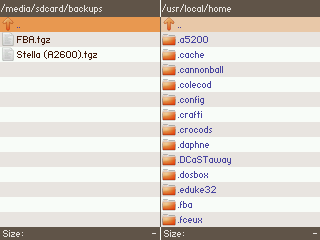
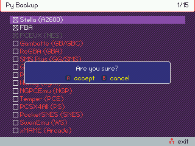

# Py Backup

Py Backup is a application that will facilitate the management of backups on the RG350 and RG280 consoles. It is designed mainly to back up the directories where the savestates of the emulators are stored, but by modifying its configuration file we can use it to make a backup/restore of any file or directory on the console.

## Installation

The application is in the form of an OPK, so it will be installed as usual by copying the file to one of the two paths that GMenu2X and SimpleMenu explores to show the launchers, that is:

* Internal card: `/media/data/apps`
* External card (in ODBeta only when the card has not label): `/media/sdcard/apps`

The OPK can be downloaded from the [releases](https://github.com/eduardofilo/RG350_py_backup/releases/latest) section of this repository.

Once installed, we can find the application in the *Applications* section of the different launchers:





## Configuration

Py Backup configuration is done through the file that is created in the following path the first time it is run:

```
/media/data/local/home/.py_backup/config.ini
```

By default it comes with the savestate directory paths of various popular emulators:

```
[DEFAULT]
destination_directory = /media/sdcard/backups
systems =
    Stella (A2600),True,/media/data/local/home/.stella/state
    FBA,True,/media/data/local/home/.fba/saves
    FCEUX (NES),True,/media/data/local/home/.fceux/fcs
    Gambatte (GB/GBC),True,/media/data/local/home/.gambatte/saves
    ReGBA (GBA),True,/media/data/local/home/.gpsp
    SMS Plus (GG/SMS),True,/media/data/local/home/.smsplus/state
    Genesis Plus (GG/SMS/MD),True,/media/data/local/home/.genplus/saves
    PicoDrive (MD),True,/media/data/local/home/.picodrive/mds
    Handy (LYNX),True,/media/data/local/home/.handy
    NGPCEmu (NGP),True,/media/data/local/home/.ngpcemu/sstates
    Temper (PCE),True,/media/data/local/home/.temper/save_states
    PCSX4All (PS),True,/media/data/local/home/.pcsx4all/sstates,/media/data/local/home/.pcsx4all/memcards
    PocketSNES (SNES),True,/media/data/local/home/.pocketsnes
    SwanEmu (WS),True,/media/data/local/home/.swanemu/sstates
    xMAME (ARCADE),True,/media/data/local/share/xmame/xmame52/sta,/media/data/local/share/xmame/xmame69/sta,/media/data/local/share/xmame/xmame84/sta
    ScummVM,True,/media/data/local/home/.local/share/scummvm/saves
    OpenBOR,True,/media/data/local/home/.OpenBOR/Saves
    Ports,True,/media/data/local/home/.nxengine,/media/data/local/home/.local/share/VVVVVV/saves,/media/data/local/home/.methane,/media/data/local/home/.sorrv5/savegame
    VBEmu (VB),True,/media/data/local/home/.vbemu/sstates
    RetroArch,True,/media/data/local/home/.retroarch/states,/media/data/local/home/.retroarch/config,/media/data/local/home/.retroarch/playlists,/media/data/local/home/.retroarch/records,/media/data/local/home/.retroarch/retroarch.cfg
    Amstrad CPC (AMSTRAD),True,/media/data/local/home/.dingux-cap32/save
    OpenMSX (MSX),True,/media/data/local/home/.openMSX/savestates
```

As we can see inside the file of type [INI](https://en.wikipedia.org/wiki/INI_file) we find two parameters:

* `destination_directory`: It contains the path on which we want the backups to be left.
* `systems`: It contains the various (one per line) backup files that we can create and manage separately. Normally each of these files will be associated with an emulator or system.

The backup files indicated in the `systems` parameter are made up of a series of elements separated by commas in the following order:

1. Backup file name. Once the backup is executed, we will find a file with this name and extension `tgz` in the directory indicated in `destination_directory`.
2. `True` or `False` to indicate if we want to enable or disable the backup file. This can be easily modified from the program's own interface, as we will see later.
3. List of files or directories (separated by commas) that will be included in the backup file.

It is important that the lines that contain the definitions of the backup files are indented with 4 spaces or a tab.

For example, we are going to analyze the configuration of the following backup file:

```
    PCSX4All (PS),True,/media/data/local/home/.pcsx4all/sstates,/media/data/local/home/.pcsx4all/memcards
```

When executing the backup, a file named `PCSX4All (PS).tgz` will appear in the directory `/media/sdcard/backups` with the contents of the following two directories:

* `/media/data/local/home/.pcsx4all/sstates`
* `/media/data/local/home/.pcsx4all/memcards`

## Usage

When we open the application for the first time we will find the backup files defined in the default configuration file. Depending on whether we have the emulators related to these files installed in our console, they will appear colored in one way or another that we will explain later. In case of having all the emulators installed, we will surely see something like the following:



In every moment the application indicates the controls available for handling. As seen in the previous screen, in this case what we could do is to navigate through the different files with Up/Down, mark or unmark (*toggle*) with the `A` key and finally execute the backup with the `B` key.

As we said before, the color with which each file is represented has a meaning. For example, in the following fragment we see the three possible colors:


The meaning of each color applied to these three files is interpreted as follows:

* White: It can be backed up and restored.
* Red: It can be backed up but not restored. Typically because the first backup hasn't been done yet.
* Gray: It cannot be backed up or restored. Typically because the files or directories configured for this backup do not exist, surely because we do not have the corresponding application/emulator installed on our machine.

The mark that appears to the left of each backup file is used to specify if we want that file to be part of the backup or restoration operations that we will execute from then on.

When there are backup files already made (white color) and one of them is marked (mark on the left), we will see that a new control appears that allows us to perform the restoration, the `X` key (*restore*). The restoration will only be carried out on the files for which there is backup. For example, in the following configuration, if we execute a restoration of the backups, only the first file will be restored (`Stella (A2600)` that appears in white) and not the second (`FBA` that appears in red) despite that both are marked to be executed:



The execution of the backup will be carried out on the two files, and in fact at the end, the second one will turn white, allowing the restoration:



We can check the generation of both backups (actually the repetition of the first and the creation of the second) if we explore the files that exist in the directory where the backups are left (if the configuration is not modified it will be `/media/sdcard/backups`):



When executing the backup and restoration operations, we will be asked for confirmation by means of a small popup:



Finally, once the operation is confirmed, we can see the progress of the backup or restoration, indicating the backup files made or restored. When making the first backup, we will also observe how the color changes from red to white, indicating the creation of the backup files that allow restoration from then on (at the beginning of the video, the PCSX4All backup is deactivated because it takes too long for the purpose of the video):

[](https://www.youtube.com/watch?v=pDfXigJ-QiI "See video")

The application can be closed at any time by pressing the `START` key.
